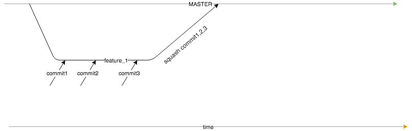

# training-git
A sandbox repo we use to train people on how to use git and what the proper merging procedure is.

## simplified git flow


Assuming there is already a master branch going on, the general steps to follow:

1. `git clone git@github.com:SCPR/training-git.git`
1. create a new (feature) branch: `git checkout -b [branch name]`
1. you are now working on the feature branch.  Make any of the changes you want here.  Commit frequently to this branch:
    * `git add .`
    * `git commit -m "short commit message"` or `git commit --amend`
1. when all your changes are written, tested, and committed and you're ready to merge to master, switch back to the master branch: `git checkout master`
1. pull in any changes that anyone else has commited to master while you were working on the feature branch: `git pull`
1. switch back to your feature branch: `git checkout [branch name]`
1. rebase those master changes into your feature branch: `git rebase master`
1. **if** you need a code review, this is where you would push your branch up to origin. Otherwise, skip to the next step.
    * `git push --set-upstream origin [branch name]`
    * ^ that creates a new branch in github.com where you can create a pull request and ask for a code review.
1. go back to master branch: `git checkout master`
1. merge your feature branch into master: `git merge --ff-only [branch name]`
1. check how many commits ahead of master you are:
    ```
    $ git st
    On branch master
    Your branch is ahead of 'origin/master' by 3 commits.
      (use "git push" to publish your local commits)
    ```
1. squash those N number of commits: `git rebase -i HEAD~N`
    * this will open up a bunch of commit messages in a text editor.
    * leave the first commit as is, and change all the lower (older) commits to `s` to squash:
        ```
        pick cb5bc5a README instructions
        s 859a9d4 More info
        ```
    * amend the commit message to include anything helpful
1. look at `git status` again and make sure it's only ahead by 1 commit
1. push to master `git push`